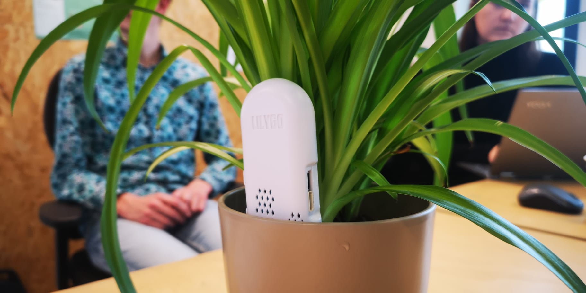
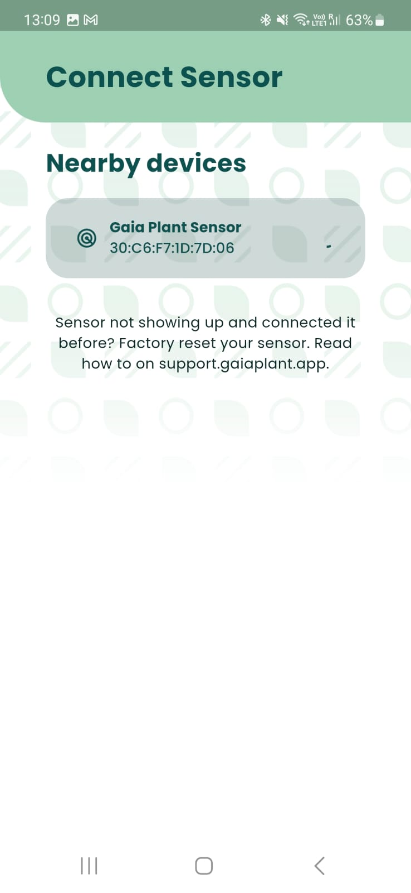
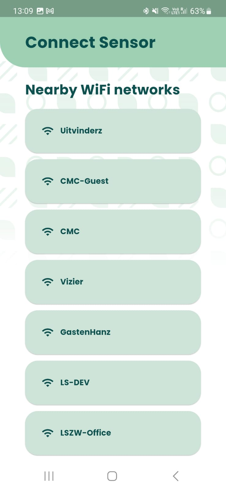
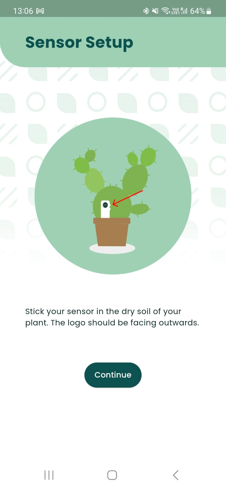
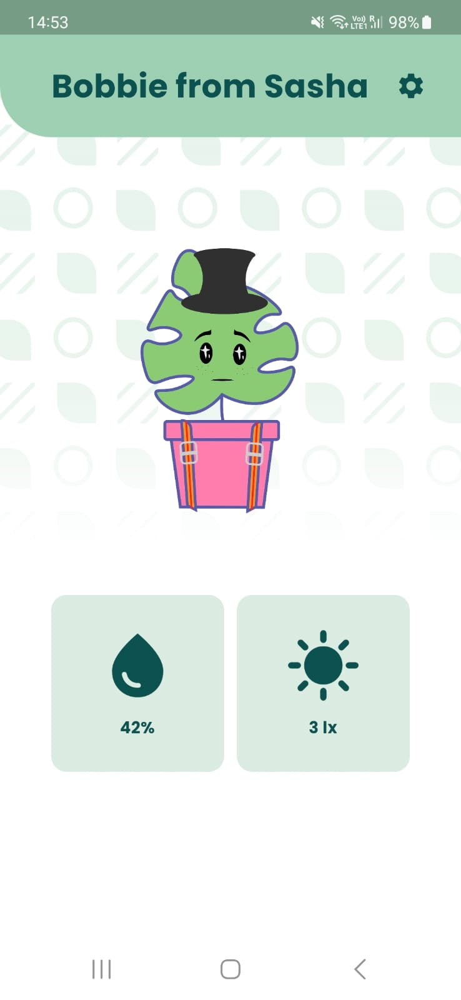
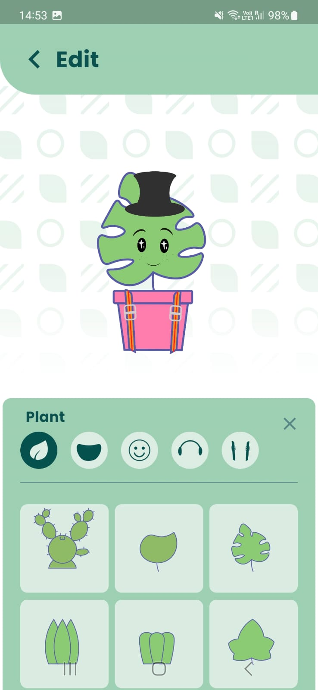

# Gaia Plant Sensor



De Gaia plant sensor is het product van een projectgroep uit het Concept and Creation semester. Tijdens dit semester is er gewerkt om een product te maken waarmee het zorgen voor een plant leuk en interactief wordt, door de plant tot leven te laten komen in een app. Dit is gedaan door middel van een IoT sensor in de plant. Uiteindelijk is er een minimale versie van het idee uitgewerkt, en deze is tijdens het kerstdiner 2022 als kerstcadeau gegeven aan docenten HBO-ICT.

<center>

{ height=200 }
{ height=200 }
{ height=200 }
{ height=200 }
{ height=200 }

</center>

Tijdens het realiseren van het idee zijn er veel keuzes gemaakt met betrekking tot de beschikbare tijd. Hierdoor is er vrij weinig tijd geweest om onderzoek te doen naar wat de hardware nu echt kan. Op dit moment wordt de staat van de avatar bepaald op de volgende manier:

- Bij het installeren van de sensor wordt deze gekalibreerd door een droge en een natte waarde (na het geven van water) te meten.
- Hierna wordt de huidige waarde als een percentage tussen de droge en natte waarde weergegeven.
- Op verschillende percentages gaat de avatar van blij naar neutraal, en van neutraal naar sip.

\clearpage
Het doel van dit project is om te achterhalen welke relaties er in de data aanwezig zijn. Denk hierbij aan:

- Heeft de plant nu te veel of te weinig water?
- Wanneer moet er weer water gegeven worden?
- Wat is de relatie tussen het type plant, de pot en hoeveel water er gegeven moet worden?
- Wat is de relatie tussen de twee grondvochtigheidsensoren?

Alle sensoren die geïnstalleerd zijn rapporteren ieder uur hun waarden. Deze zijn bijgehouden in een database, waar ondertussen al 15000 regels aan waarden in zitten. 

## Techniek

Het systeem bestaat uit twee delen: Een app die praat met een microservice backend, en de hardware sensor die hier zijn log waarden naar toe stuurt. Omdat er gewerkt wordt met een microservice backend is er geen voorkeur voor taal of framework, er kan gewerkt worden met welke gewenste tooling. Gaia heeft wel een doel om zo klimaat neutraal te werken, en daarom is tijdens het opzetten van verschillende projecten nagedacht over de impact van bijvoorbeeld taalkeuze. Zie bijvoorbeeld deze paper, tabel 4 op pagina 9: [doi:10.1145/3136014.3136031](https://www.researchgate.net/publication/320436353_Energy_efficiency_across_programming_languages_how_do_energy_time_and_memory_relate).

```plantuml

scale 2

cloud gaia [
Gaia Cloud
]

card sensor [
IoT Hardware Sensor
]

card phone [
Android/iOS App
]

sensor -u-> gaia : Upload sensor waarden ieder uur
gaia -d-> phone : Haalt sensor waarden op
phone -> sensor : Configureert Wifi over Bluetooth

```
