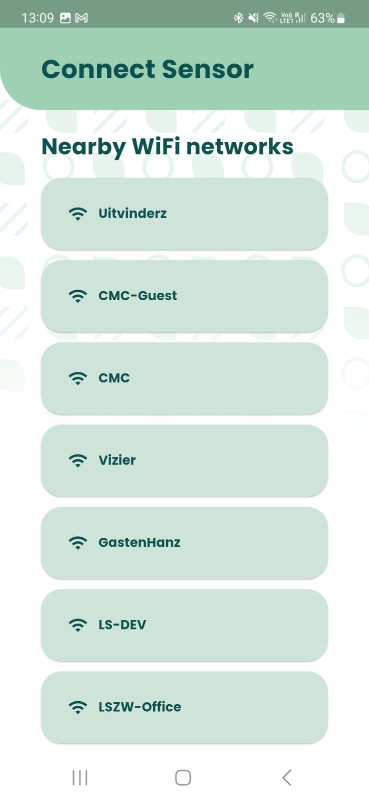
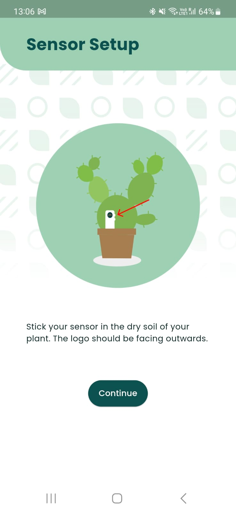

# Gaia Plant Sensor


De Gaia plant sensor is het product van een projectgroep uit het Concept and Creation semester. Tijdens dit semester is er gewerkt om een product te maken waarmee het zorgen voor een plant leuk en interactief wordt, door de plant tot leven te laten komen in een app door middel van een IoT sensor in de plant. Uiteindelijk is er een minimale versie van het idee uitgewerkt, en deze is tijdens het kerstdiner 2022 als kerstcadeau gegeven aan docenten HBO-ICT.

<center>

{ height=200 }
{ height=200 }
{ height=200 }
{ height=200 }
{ height=200 }

</center>

Tijdens het realiseren van het idee zijn er veel keuzes gemaakt met betrekking tot de beschikbare tijd. Hierdoor is er nog veel te wensen aan de huidige implementatie, vooral op het gebied van de hardware van de IoT sensor. De belangrijkste wensen zijn het volgende:

- Batterij duur van de sensor verbeteren,
- Mesh networking implementeren zodat er meerdere sensoren gebruikt kunnen worden ook in gebieden waar ontvangst van Wifi slecht is (zoals in de tuin),
- Nieuwe hardware ontwikkelen die lager in kosten is dan het huidige prototype.

Dit project geeft de kans om een IoT sensor compleet opnieuw te ontwikkelen, beide in hardware en firmware, en deze aan te sluiten bij een al bestaande infrastructuur.

\clearpage
## Techniek


Op dit moment wordt er gebruik gemaakt van de LILYGO TT-GO T-HiGrow. Deze off-the-shelf sensor bevat een ESP-32, 200mAh lipo met oplaadcircuit, conductieve en resistieve grondvochtigheid elektroden, DHT11 luchtvochtigheid en temperatuursensor, en een BH1750 lichtsensor. De firmware hierop maakt gebruik van de Espressif Blufi library om Wifi te configureren over Bluetooth, en krijgt een uniek id en token via de telefoon toegezonden. Met deze gegevens kunnen er sensorwaarden gelogd worden door een HTTPS call te maken. Hiervoor is een backend geschreven bestaande uit meerdere microservices. Deze is ingericht op de ondersteuning voor meerdere sensoren per telefoon, hoewel dit nu nog niet geïmplementeerd is in de app.

```plantuml

scale 2

cloud gaia [
Gaia Cloud
]

card sensor [
ESP-32 Hardware Sensor
]

card phone [
Android/iOS App
]

sensor -u-> gaia : Upload sensor waarden ieder uur
gaia -d-> phone : Haalt sensor waarden op
phone -> sensor : Configureert Wifi over Bluetooth

```
